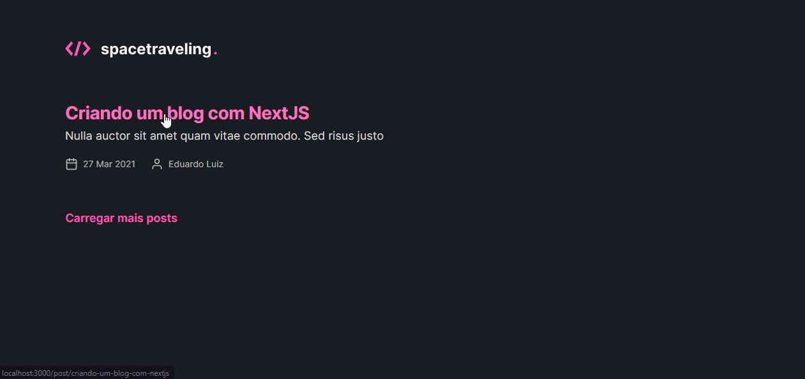
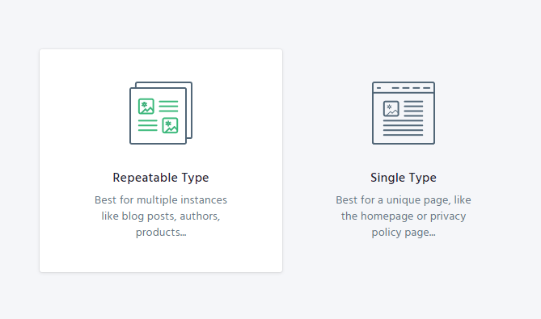

<p align="center">
  
</p>

<br />

<h1 align="center">
    
</h1>

<p align="center">
  <a href="#technologies">Technologies</a>&nbsp;&nbsp;&nbsp;|&nbsp;&nbsp;&nbsp;
  <a href="#-layout">Getting started</a>&nbsp;&nbsp;&nbsp;|&nbsp;&nbsp;&nbsp;
  <a href="#-project">Project</a>&nbsp;&nbsp;&nbsp;|&nbsp;&nbsp;&nbsp;
  <a href="#-layout">Template</a>&nbsp;&nbsp;&nbsp;|&nbsp;&nbsp;&nbsp;
  <a href="#-license">License</a>
</p>

<br>

## 🧪 Technologies

This project was developed using the following technologies:

- [React](https://reactjs.org)
- [NextJS](https://nextjs.org/)
- [Prismic](https://prismic.io/)
- [Date FNS](https://date-fns.org/)
- [TypeScript](https://www.typescriptlang.org/)
- [SASS](https://sass-lang.com/)

<!-- ## 🔥 Preview


<p align="center">
  <a href="" target="_blank">
    
  </a>
</p> -->

## 🚀 Getting started

Clone the project and access the folder

## ✨ Step 1

```bash
$ git clone git@github.com:eduardoluizdev/ignite-nextjs-blog.git && cd ignite-nextjs-blog
```
## ✨ Step 2
Follow the steps below

```bash
# Install the dependencies
$ yarn

# Start the project
$ yarn dev
```

## ✨ Step 2

For the project to run, you will need to create an account on the [Prismic](https://prismic.io/) website and create a repository and name it "posts" and then in your account set it up as a Repeatable Type:



## ✨ Step 3

After creating, configure it with the following fields:

```bash
- # slug
    - Type: UID
- # title
    - Type: Key Text
- ## subtitle
    - Type: Key Text
- ## author
    - Type: Key Text
- ## banner
    - Type: Image
- ## content - Group
    - Type: Key Text
    ## Internal fields:
      ## heading
          - Type: Key Text
      ## body
          - Type: Rich Text
```
## ✨ Step 4

Create and configure endpoint, get url in API settings.

```bash
  # Configure .env.local

  PRISMIC_API_ENDPOINT=
```

## 💻 Project

Conclusion project for chapter three. It was developed with everything I’ve learned so far at Ignite.

## 🔖 Template

You can view the project template through the links below:

- [Application Template](https://github.com/rocketseat-education/ignite-template-reactjs-criando-um-projeto-do-zero)

## 📝 License

This project is licensed under the MIT License.

---

<p align="center">Made with 💜 by Eduardo Luiz</p>
